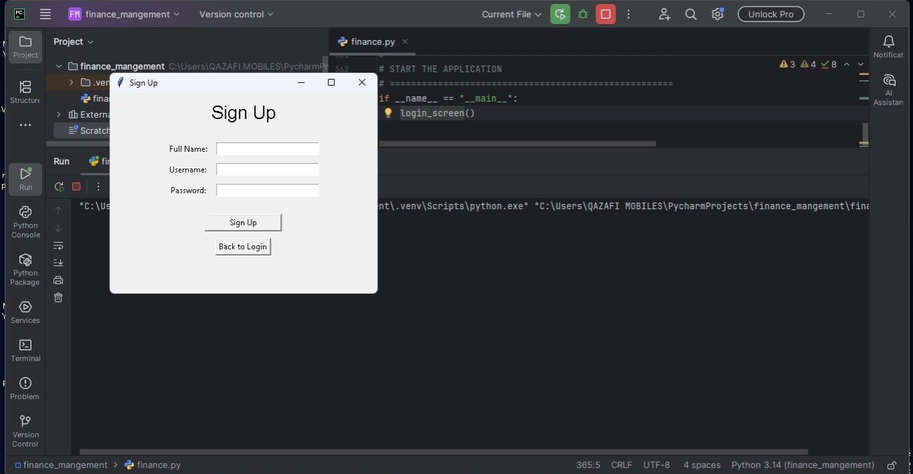
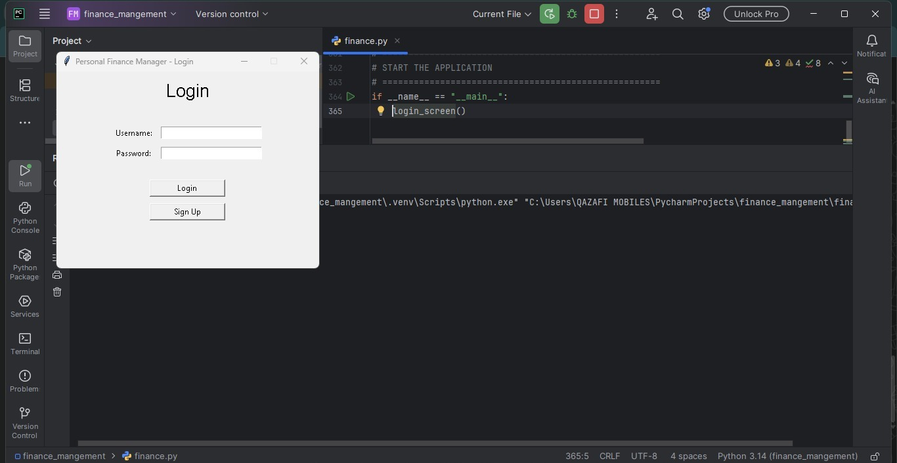
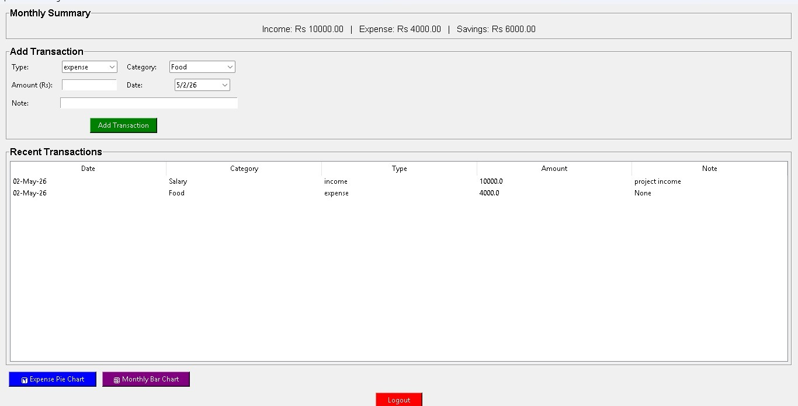
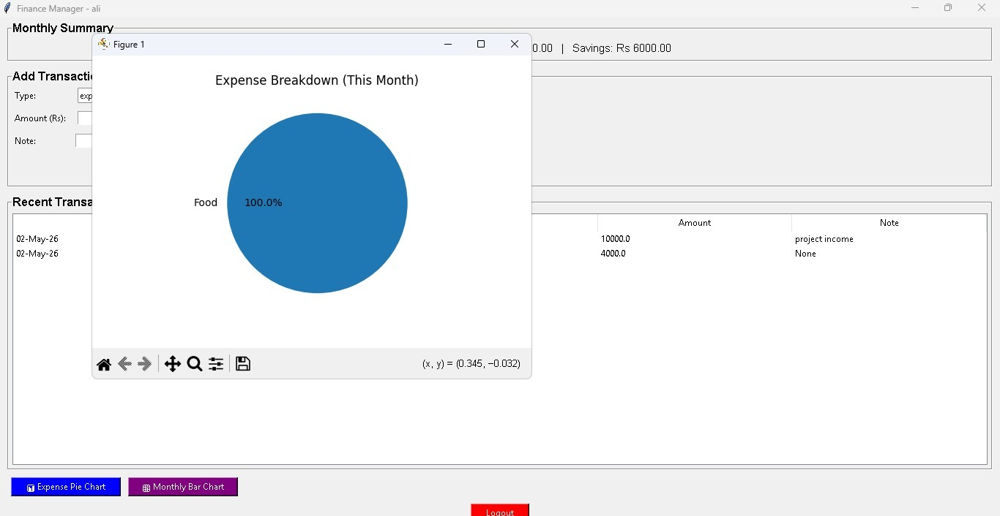
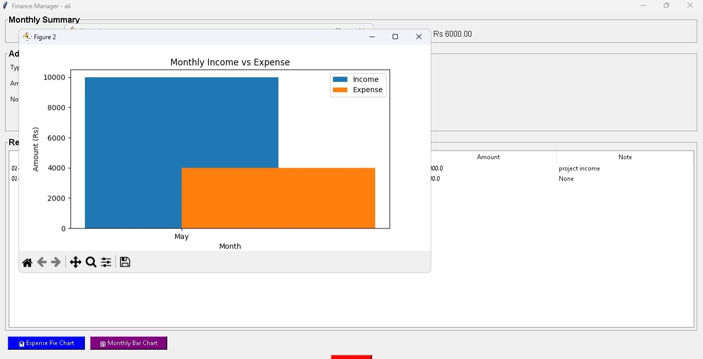

# 💰 Personal Finance Manager

A desktop application to track your income, expenses, and savings with visual charts – built with **Python**, **Oracle Database**, and **Tkinter**.

---

## 📌 Features

- 🔐 User authentication (signup / login) with SHA‑256 password hashing
- ➕ Add transactions (income / expense) by category, amount, date & note
- 📊 Monthly summary – total income, expense, and savings (auto-calculated)
- 📋 Recent transactions list (last 20 entries)
- 🥧 Pie chart – expense breakdown by category (current month)
- 📈 Bar chart – monthly income vs expense (current year)
- 🗄️ Oracle Database (11g compatible) – persistent storage with sequences & triggers
- ⚠️ Error handling & logging – silent logging to `app.log`

---

## 🛠️ Tech Stack

| Layer       | Technology                          |
|-------------|-------------------------------------|
| Language    | Python 3.14                         |
| GUI         | Tkinter (built-in)                  |
| Database    | Oracle 11g / XE                     |
| DB Driver   | `python-oracledb` (thick mode)      |
| Charts      | Matplotlib                          |
| Hashing     | hashlib (SHA‑256)                   |

---

## 📁 Project Structure

personal-finance-manager/
│
├── app.py                 # Main application

├── config.example.py      # Template for credentials

├── config.py              # Your actual credentials (not uploaded to git)

├── requirements.txt       # Python dependencies

├── database.sql           # Oracle schema (tables, sequences, triggers, categories)

├── .gitignore             # Ignores config.py, logs, etc.

└── README.md              # This file

🚀 Setup Instructions
1. Install Requirements
   
2.pip install -r requirements.txt

3. Setup Database
   
Open Oracle SQL Developer

Run database.sql

3. Configure Credentials
   
Rename config.example.py → config.py

Edit config.py:

DB_USER = "your_username"

DB_PASS = "your_password"

DB_HOST = "localhost"

DB_PORT = "1521"

DB_SERVICE = "XE"   # or XEPDB1, ORCL

. Set Oracle Instant Client Path
   
In app.py, update the path:

oracledb.init_oracle_client(lib_dir=r"C:\instantclient_21_8")

 Run Project
   
python app.py

👨‍💻 Author

Muhammad Younas

Junior Python & Web Developer

🎓 Learning Highlights

Oracle 11g compatibility (ROWNUM, sequences & triggers)

Secure password hashing with SHA‑256

Tkinter GUI application development

Database integration with Python

Data visualization using Matplotlib

Clean project structure for GitHub

📜 License

This project is for educational purposes – part of the Database Systems course.

🙏 Acknowledgements

Oracle Database

Python & Tkinter

Matplotlib
